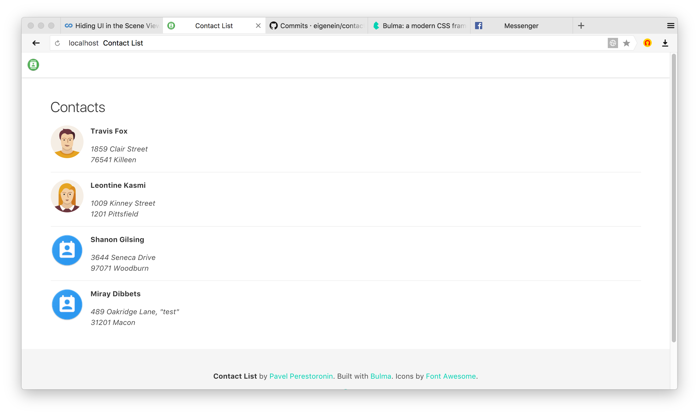

### Notes and assumptions to make it simple

* I didn't have any Django experience before (just FYI).
* Main app (`app`) and API (`api`) are implemented as two apps within one Django project.
* I didn't implement contacts paging.
* Everywhere I use built-in local-memory caching.
* I didn't care about Python 2.x compatibility.
* Images are proxified through API to enable caching and/or ability to replace the source.
* Requests to external sources and API are made directly from request handlers.

### Questions to clarify

* **No** authentication (is it needed?).
* `setup.py` and other deployment things are **missing**.
* CSV file size **is not checked**.
* Image file size **is not checked**.
* Tests are **missing**.

